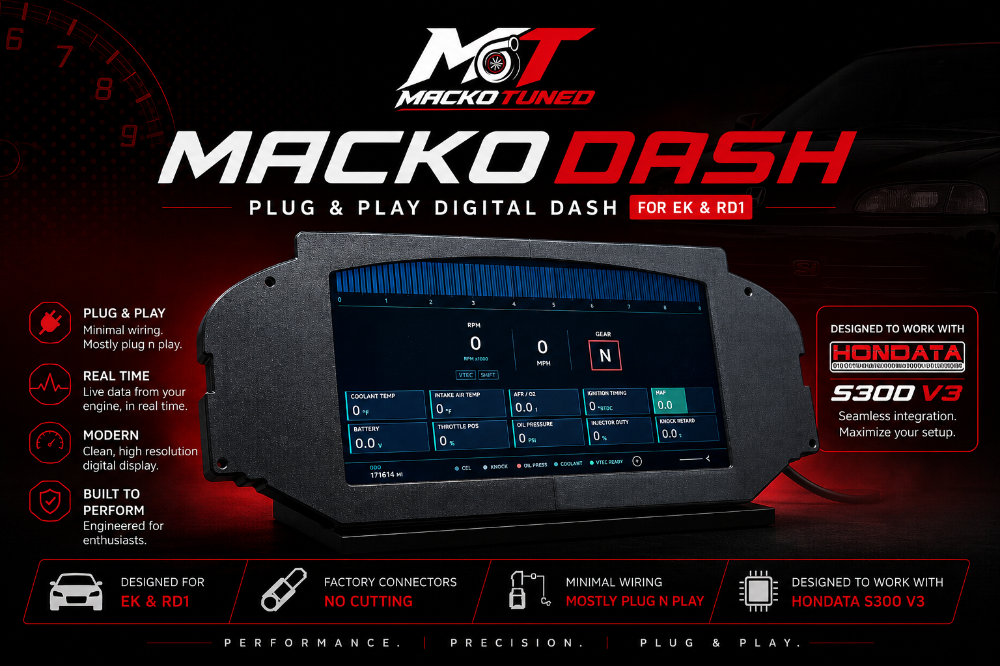
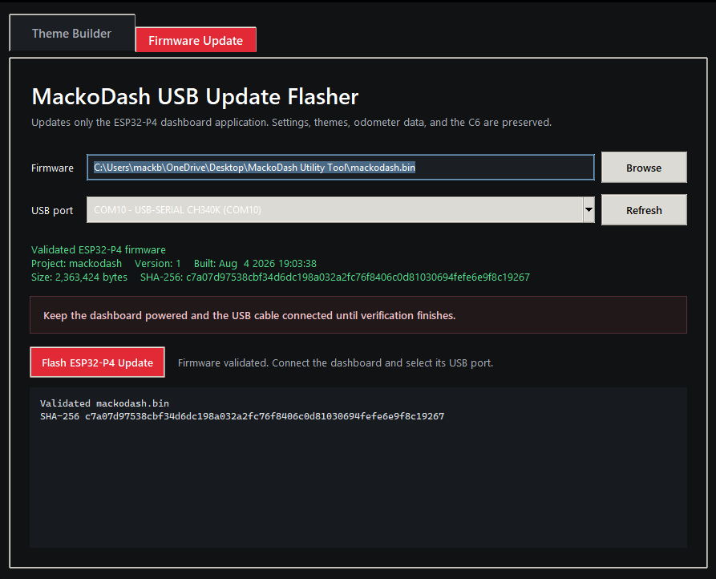

# MackoDash Flash Tools

**Official firmware update &amp; custom theme tools for the MackoDash digital gauge cluster**

[Overview](#overview) •
[Compatible Vehicles](#compatible-vehicles) •
[What's Included](#whats-included) •
[Getting Started](#getting-started) •
[Firmware Update](#firmware-update) •
[Custom Themes](#custom-themes) •
[Troubleshooting](#troubleshooting) •
[Support](#support)

---

## Overview

**MackoDash** is a plug &amp; play digital gauge cluster built around a dual-ESP32 platform — an **ESP32-P4** running the dashboard application and UI, paired with an **ESP32-C6** co-processor. It's designed as a direct replacement for the OEM instrument cluster.

This repository contains the official **MackoDash Utility**, the Windows app MackoDash customers use to:

- ⚡ **Update dashboard firmware** on the ESP32-P4
- 🎨 **Build and install custom SD-card themes** designed in SquareLine Studio

Designed to work seamlessly with **Hondata S300 V3**, with minimal wiring and factory connectors — no cutting required.

## Compatible Vehicles

| Chassis | Model |
|---|---|
| EK | Honda Civic |
| RD1 | Honda CR-V |

## What's Included

| File | Description |
|---|---|
| [`MackoDashUtility.exe`](MackoDashUtility.exe) | Windows app — Firmware Update tab + Theme Builder tab |
| [`mackodash.bin`](mackodash.bin) | ESP32-P4 dashboard application firmware |
| [`CUSTOMER_INSTRUCTIONS.txt`](CUSTOMER_INSTRUCTIONS.txt) | Quick-start instructions (also covered below) |
| [`MackoDash_SquareLine_Customer_Instructions.txt`](MackoDash_SquareLine_Customer_Instructions.txt) | Full custom theme object-naming reference (formatted version: [squareline-theme-guide.md](squareline-theme-guide.md)) |

> **Keep these files together.** `MackoDashUtility.exe`, `mackodash.bin`, and both `.txt` files need to stay in the same folder for the utility to work correctly.

## Requirements

- Windows PC
- USB update cable
- MackoDash dashboard, powered on for the entire process

## Getting Started

1. Click the green **Code** button above → **Download ZIP** (or clone the repo).
2. Extract the ZIP anywhere on your PC — keep all the extracted files together in that folder.
3. Launch `MackoDashUtility.exe`.

## Firmware Update

  
   
  The Firmware Update tab, validating <code>mackodash.bin</code> before flashing

> ⚠️ **Keep the dashboard powered and the USB cable connected for the entire update. Do not unplug either until verification finishes.**

1. Connect MackoDash to your Windows PC with its update USB cable.
2. Keep the dashboard powered for the entire update.
3. Open the **Firmware Update** tab in MackoDash Utility.
4. Confirm that `mackodash.bin` shows as **Validated**.
5. Confirm the dashboard's COM port.
6. Select **Flash ESP32-P4 Update** and wait for verification to finish.

This update writes **only** the ESP32-P4 dashboard application. Your settings, odometer data, SD-card themes, SPIFFS, and ESP32-C6 firmware are all preserved.

## Custom Themes

MackoDash supports fully custom dashboard themes designed in **SquareLine Studio** (LVGL 8.4, 1024×600 canvas) and installed via SD card.

**Quick version:**

1. Design your dashboard in SquareLine Studio, naming any live-data objects using the [MackoDash naming convention](squareline-theme-guide.md) (e.g. `dash_rpm_value`, `dash_speed_bar`, `dash_coolant_arc`).
2. Export the complete project and ZIP the exported folder.
3. Open MackoDash Utility → **Theme Builder** tab.
4. Select the SquareLine ZIP, enter a theme name and ID, then **Build Theme** → **Copy to SD Card**.
5. Insert the SD card into MackoDash and reboot.

📄 **See the full [SquareLine Theming Guide](squareline-theme-guide.md)** for every supported object name, live value, Bar/Arc range, and design rule.

## Troubleshooting

| Issue | Fix |
|---|---|
| USB port shows busy / won't connect | Close serial monitors and any other flashing programs, then retry |
| Firmware doesn't show as Validated | Re-download `mackodash.bin` and make sure it's in the same folder as the utility |
| Theme fails strict validation | Check object names against the [theming guide](squareline-theme-guide.md) — strict mode is intentional and stops on unsupported fonts/objects rather than guessing |

## Support

- 📧 Email: [mackotuned@gmail.com](mailto:mackotuned@gmail.com)
- 📷 Instagram: [@cream_civic](https://instagram.com/cream_civic)
- 🎵 TikTok: [@mackotuned](https://tiktok.com/@mackotuned)
- 🛒 Shop: coming soon

Found an issue not covered here? Open an [Issue](../../issues) on this repo.

## License

This project is licensed under the [MIT License](LICENSE).

---

Built for the MackoDash community 🏁

